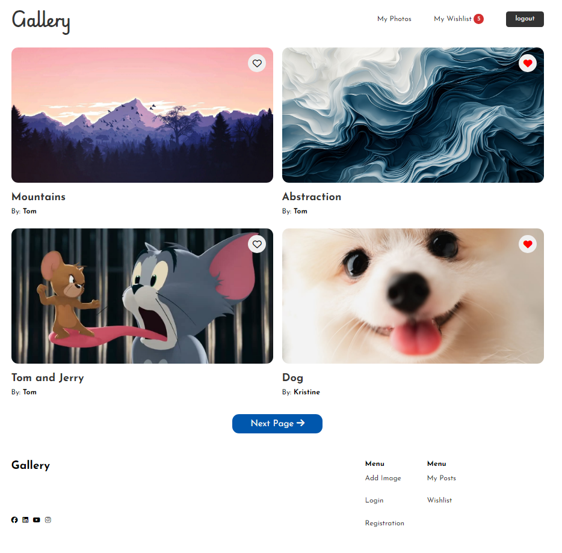

# Gallery Web App



Welcome to the Gallery Web App! This application allows users to upload, manage, and view their image collections in an organized and visually appealing way.

## Features

- **User Authentication**
- **Image Upload**
- **Image Gallery**
- **Image Download**
- **Image Like**
- **Responsive Design**

## Installation

1. Clone the repository:

   ```bash
   git clone https://github.com/Miqayel87/gallery_php
   ```

2. Set up the database:

   Create database and import resources/database.sql

3. DB configs:

   Set DB configs in config/config.php

4. Run SASS:
   ```bash
   sass --watch resources/sass/style.scss resources/css/style.css
   ```

